<p align="center">
  
</p>

<h1 align="center">Rename Plus</h1>

<p align="center">
  Batch file and folder renamer with a live preview, for Linux and Windows.
</p>

<p align="center">
  <b>English</b> · <a href="README.pt-BR.md">Português (Brasil)</a> · <a href="README.es-ES.md">Español</a>
</p>

<p align="center">
  <a href="https://github.com/generson-a-silva/rename-plus/releases/latest"></a>
  
  
  
  
</p>

<p align="center">
  <a href="https://github.com/generson-a-silva/rename-plus/releases/latest"></a>
  <a href="https://www.renameplus.app.br/en/"></a>
</p>

<p align="center">
  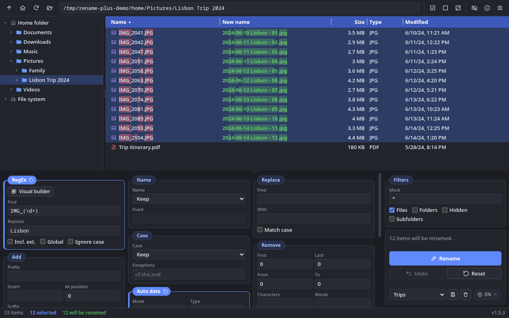
</p>

---

## Contents

- [About](#about)
- [Screenshots](#screenshots)
- [Inspiration and credits](#inspiration-and-credits)
- [Features](#features)
- [How the rules are applied](#how-the-rules-are-applied)
- [What Rename Plus doesn't do](#what-rename-plus-doesnt-do)
- [Supported platforms](#supported-platforms)
- [Installation](#installation)
- [Keyboard shortcuts](#keyboard-shortcuts)
- [Development](#development)
- [Where settings are stored](#where-settings-are-stored)
- [Author](#author)

## About

**Rename Plus** renames many files and folders at once using rules you can combine: regular expressions, text replacement, letter case, removing parts of the name, prefixes and suffixes, dates, folder names, numbering and extensions.

Nothing touches the disk until you confirm. The **New name** column shows the result for every selected item as you type. Conflicts, such as two files ending up with the same name or characters the system doesn't allow, are shown in red and block the operation. After renaming, you can **undo** the last batch.

The window has three areas: the folder tree on the left, the file list on the right and the rule panels at the bottom, with the **Rename**, **Undo** and **Reset** buttons always in view.

More about the project, with downloads for each system, on the website: **[renameplus.app.br](https://www.renameplus.app.br/en/)**.

## Screenshots

The screenshots show the English interface. The app is also available in Portuguese and Spanish.

<table>
  <tr>
    <td width="50%" valign="top">
      <a href="docs/screenshots/boas-vindas.png">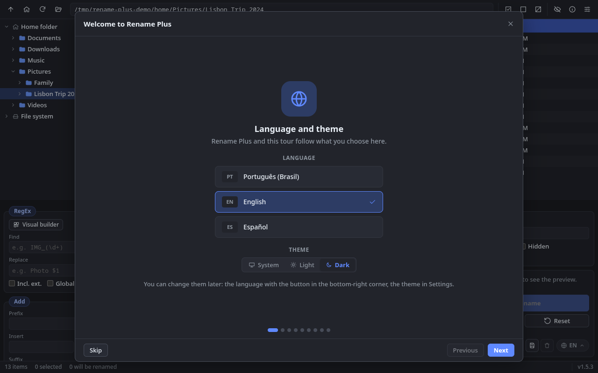</a>
      <p><b>Welcome screen.</b> On the first run, pick the language and the theme; the whole app switches right away.</p>
    </td>
    <td width="50%" valign="top">
      <a href="docs/screenshots/boas-vindas-recursos.png">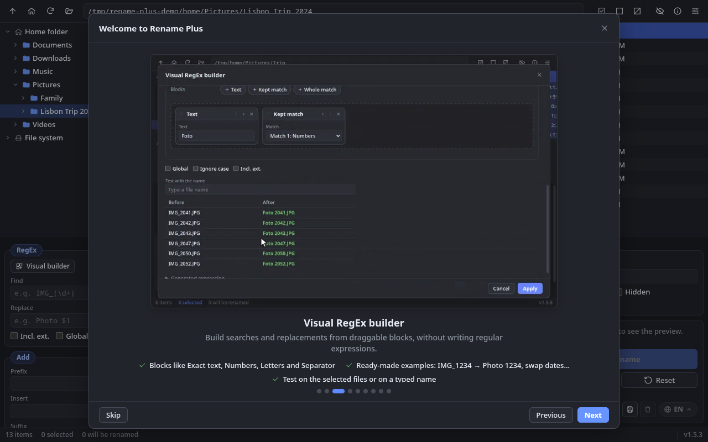</a>
      <p><b>Feature tour.</b> Each feature comes with an animation recorded from the app itself. To see it again, use the ⓘ button in the top bar.</p>
    </td>
  </tr>
  <tr>
    <td width="50%" valign="top">
      <a href="docs/screenshots/subpastas.png">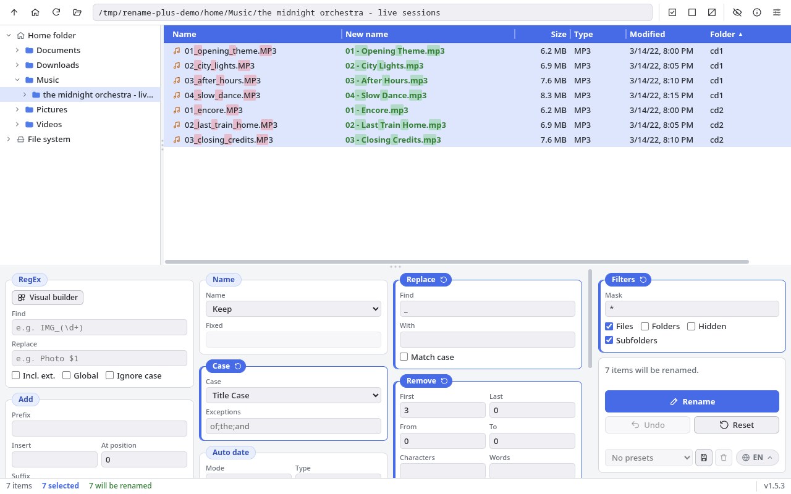</a>
      <p><b>Several rules and subfolders.</b> Remove, Replace, Title case, per-folder Numbering and a lowercase extension, applied to the tracks of two CDs at once (light theme).</p>
    </td>
    <td width="50%" valign="top">
      <a href="docs/screenshots/conflitos.png">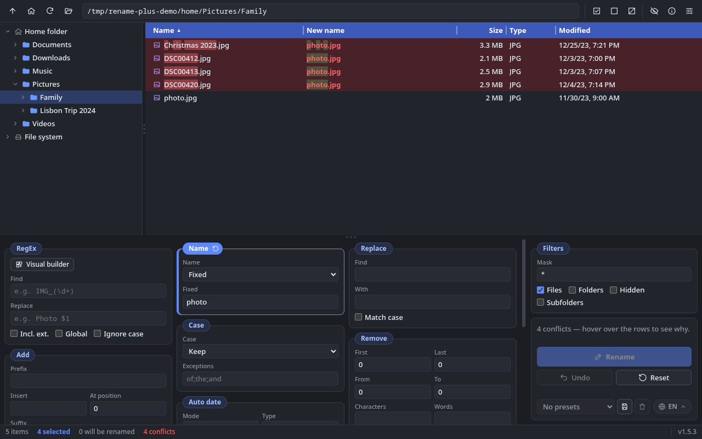</a>
      <p><b>Conflicts.</b> Names repeated in the batch, or matching a file that already exists, turn red and the Rename button is disabled. Hover over a row to see why.</p>
    </td>
  </tr>
  <tr>
    <td width="50%" valign="top">
      <a href="docs/screenshots/erros.png">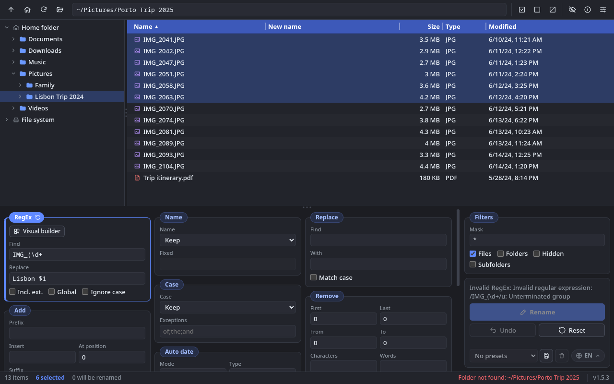</a>
      <p><b>Error messages.</b> An invalid RegEx is explained in the actions panel; a path typed in the address bar that doesn't exist is reported in red in the status bar.</p>
    </td>
    <td width="50%" valign="top">
      <a href="docs/screenshots/validacao.png">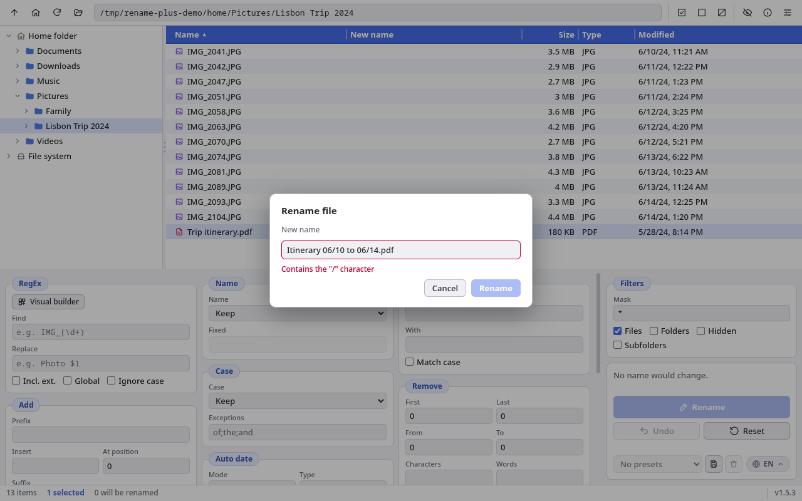</a>
      <p><b>Name validation.</b> When renaming a single item (F2) or creating a folder, names the system won't accept are flagged before you confirm.</p>
    </td>
  </tr>
  <tr>
    <td width="50%" valign="top">
      <a href="docs/screenshots/arrastar.png">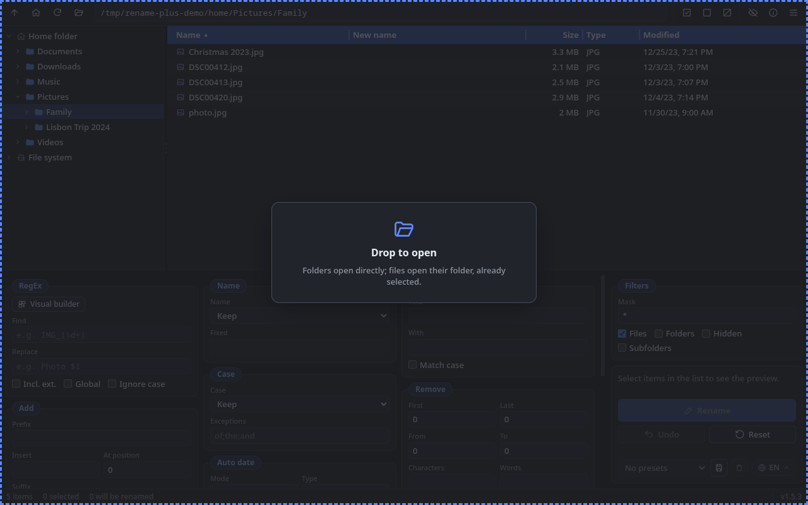</a>
      <p><b>Drag and drop.</b> Drop a folder to open it, or drop files to open their folder with them already selected.</p>
    </td>
    <td width="50%" valign="top">
      <a href="docs/screenshots/configuracoes.png">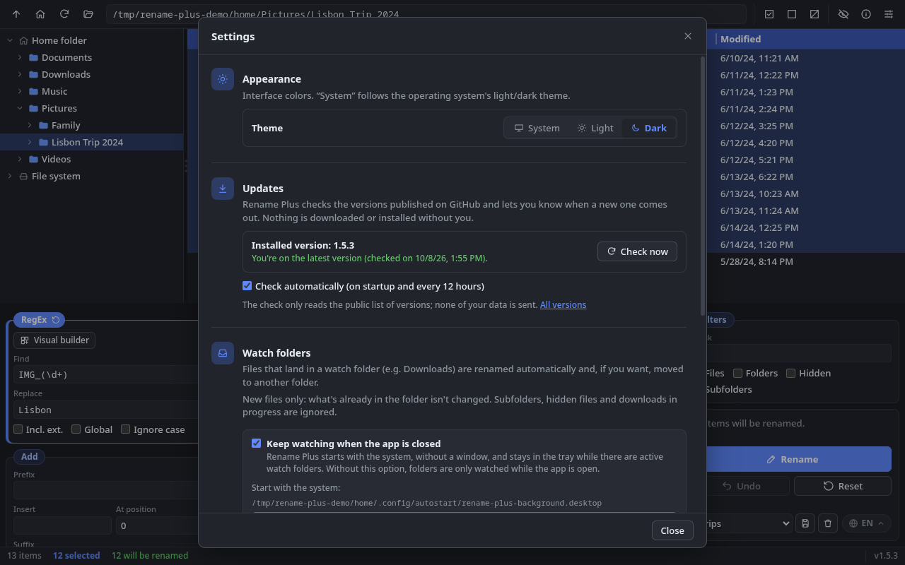</a>
      <p><b>Settings.</b> Interface theme, update checks on GitHub and watch folders, besides the "Open in Rename Plus" entries in the file manager's context menu.</p>
    </td>
  </tr>
  <tr>
    <td width="50%" valign="top">
      <a href="docs/screenshots/construtor-regex.png">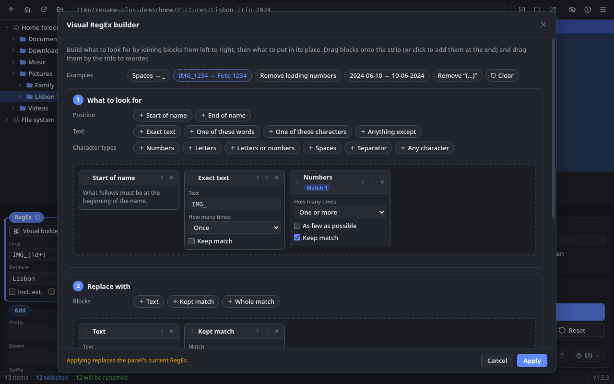</a>
      <p><b>Visual RegEx builder.</b> The search and the replacement are built from drag-and-drop blocks, with ready-made examples. Here, <code>IMG_2041.JPG</code> becomes <code>Foto 2041.JPG</code>.</p>
    </td>
    <td width="50%" valign="top">
      <a href="docs/screenshots/pastas-monitoradas.png">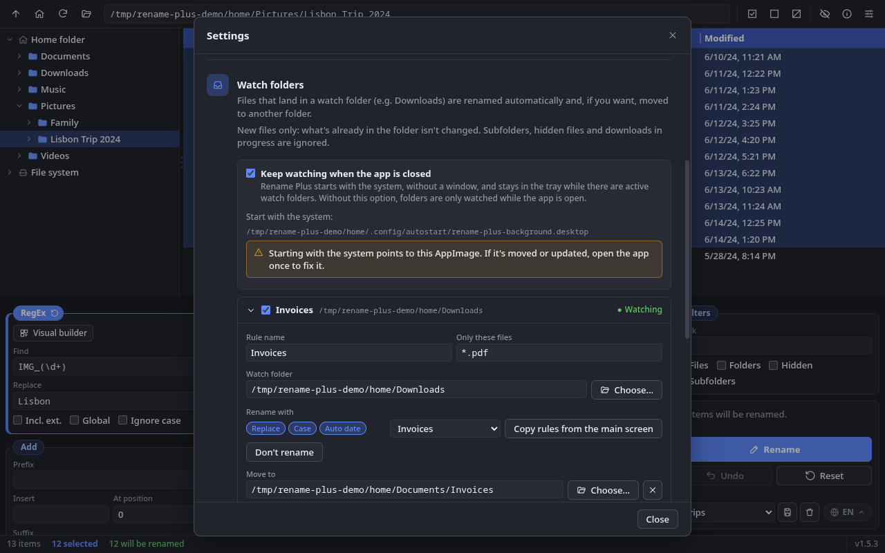</a>
      <p><b>Watch folders.</b> PDFs that land in Downloads get the date in front, Title Case and go to <code>Documents/Invoices</code>, even with the app closed (background watching on).</p>
    </td>
  </tr>
  <tr>
    <td width="50%" valign="top">
      <a href="docs/screenshots/pastas-monitoradas-atividade.png">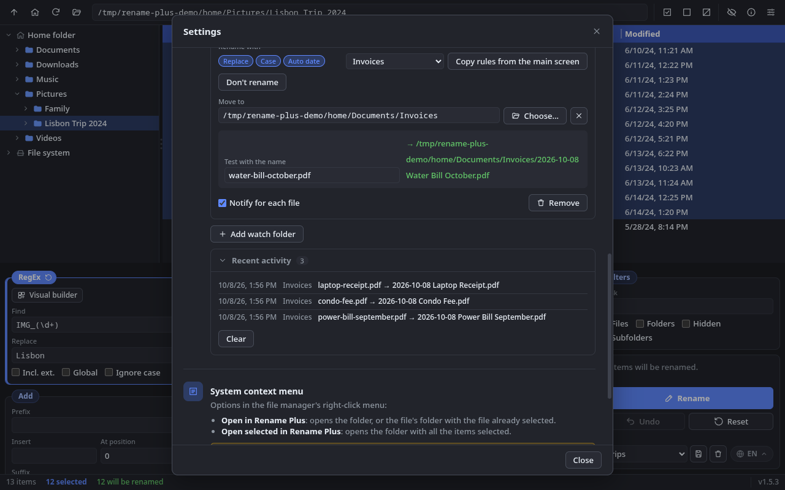</a>
      <p><b>Test and activity.</b> Try the rule with a sample name before any file arrives, and see what was renamed (or what failed) in the activity log.</p>
    </td>
    <td width="50%" valign="top">
      <a href="docs/screenshots/presets.png">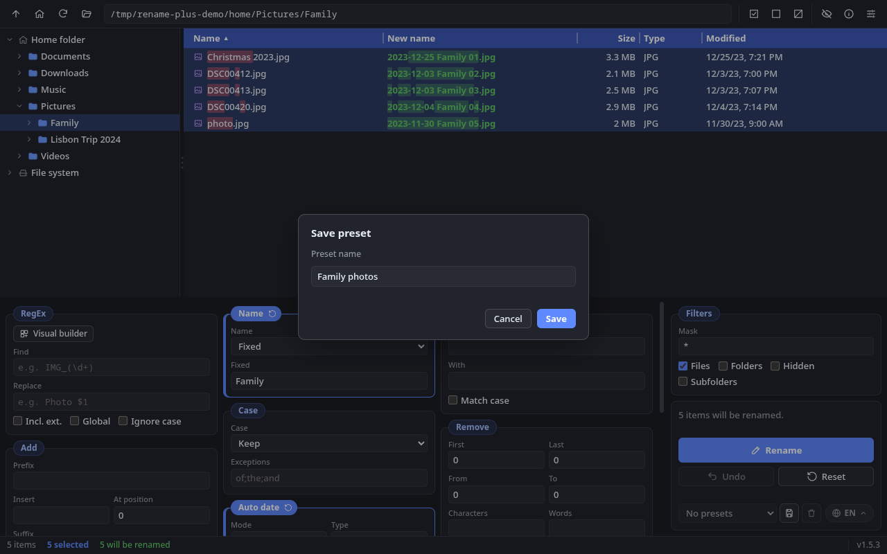</a>
      <p><b>Presets.</b> The save button next to the presets list stores the current combination of rules (here, fixed Name, Auto date and Numbering) under a name. Pick it again from the list next to the language selector or in a watch folder rule.</p>
    </td>
  </tr>
</table>

## Inspiration and credits

Rename Plus is inspired by **[Bulk Rename Utility](https://github.com/BulkRenameUtility/download)**, a closed-source batch renamer for Windows. The numbered panels and the order in which the rules are applied follow the model it made popular.

Rename Plus is an independent project, written from scratch:

- it **uses no code** from Bulk Rename Utility;
- it is **not affiliated with** or endorsed by its authors;
- it is **not a full replacement**: see [what Rename Plus doesn't do](#what-rename-plus-doesnt-do).

If you're on Windows and need advanced features such as EXIF/ID3 metadata, JavaScript scripting or CSV import, take a look at Bulk Rename Utility.

## Features

### Renaming rules

| Panel | What it does |
|---|---|
| **RegEx** | Find and replace with regular expressions, with capture groups (`$1`, `$2`…), an option to include the extension, global replacement and case-insensitive matching. The **Visual builder** lets you put the expression together from drag-and-drop blocks, without typing RegEx. |
| **Name** | Keep, remove, replace with a fixed name or reverse the original name. |
| **Replace** | Plain text replacement, case-sensitive or not. |
| **Case** | lowercase, UPPERCASE, Title Case and Sentence case, with a list of words to leave untouched. |
| **Remove** | First/last N characters, a range of positions, specific characters and words, crop before/after a piece of text, digits, accents, symbols, non-ASCII characters, double spaces, leading/trailing spaces and leading dots. |
| **Add** | Prefix, suffix, insertion at a position (negative counts from the end) and splitting joined words (`MyPhoto` → `My Photo`). |
| **Auto date** | Modified, created or current date, as a prefix or suffix, in any format (`YYYY-MM-DD`, `DD.MM.YY`…). |
| **Folder name** | Adds the name of one or more parent folders. |
| **Numbering** | Prefix, suffix, both or at a position; start, step, zero padding; `1, 2, 3`, `a, b, c`, `A, B, C` and `I, II, III` styles; restart in each folder. |
| **Extension** | Keep, lowercase, UPPERCASE, Title, remove, replace with a fixed one or append an extra one. |
| **Filters** | Name mask (`*.jpg; *.png`), files and/or folders, hidden items and subfolder contents (recursive mode). Sits in the actions column. |

**Presets:** the save button next to the presets list (by the language selector) stores the current rules under a name. To apply them again, pick the preset from that list; the trash button next to it deletes the selected one. Watch folder rules have the same list.

### Visual RegEx builder

For people who don't write regular expressions: in the **RegEx** panel, the **Visual builder** button opens a screen where you build the search from blocks, left to right ("Start of name", "Exact text", "Numbers", "Letters", "Separator", "One of these words"…), and the replacement too ("Text", "Kept match", "Whole match").

- Drag blocks from the palette onto the strip (or click to add them at the end) and drag them by their title to reorder; the ◀ ▶ buttons do the same from the keyboard.
- Each block sets how many times it appears (once, optional, one or more, exactly N, between N and M) and whether to **keep the match** so you can reuse it in the replacement.
- Ready-made examples: spaces → `_`, `IMG_1234` → `Foto 1234`, remove leading numbers, swap dates `2024-06-10` → `10-06-2024`, remove `(…)`.
- Preview on the selected files and on a name you type; the generated expression is visible if you want to check it.

### Watch folders

In **Settings › Watch folders**, pick a folder (e.g. Downloads): every new file that lands there is renamed automatically and, if you want, moved to another folder. There are no watch folders by default.

- The renaming rules are the ones from the main screen: set them up with the preview and use **Copy rules from the main screen**, or pick a saved preset.
- File mask (`*.pdf; *.jpg`), optional destination folder, a test with a sample name and a system notification for each file.
- Waits for the file to finish being written and ignores downloads in progress (`.crdownload`, `.part`…), hidden files and subfolders. Never overwrites: repeated names get ` (2)`.
- Only new files are handled (what's already in the folder is left alone). The activity log shows what was done and any failures.
- **Keeps working with the app closed:** with **Keep watching when the app is closed** turned on, Rename Plus starts with your session, without a window, and stays in the tray while there are active watch folders (tray menu: open, quit). Opening the app just shows the window in that same process. With no active watch folders it exits right away, so nothing keeps running for nothing.
  - **Windows:** the installer has a "Watch folders" page to turn it on for all users (on by default; untick it to install without it). Each user can turn it off in Settings.
  - **Linux (AppImage):** there's no install step, so turn it on in Settings. It adds `~/.config/autostart/rename-plus-background.desktop` (XDG Autostart, used by KDE, GNOME, Xfce, Cinnamon…). If you move or replace the AppImage, open it once to fix the entry; opening a new AppImage while the old one runs in the background hands over to the new one.

### Updates

The app checks the [GitHub releases](https://github.com/generson-a-silva/rename-plus/releases) on startup and every 12 hours, and lets you know when a new version is out (a system notification and a notice in the status bar). Nothing is downloaded or installed automatically. In **Settings › Updates** you can check right away, skip a version or turn checking off.

### Preview and safety

- **Live preview:** the new name is worked out as you type, only for the selected items.
- **Conflict detection:** duplicate names in the batch, clashes with existing files and names the system won't accept. For example: `/` on Linux; `< > : " \ | ? *`, `CON`, `NUL` and a trailing dot or space on Windows. Hover over the row to see the reason.
- **All-or-nothing renaming:** the batch is validated before anything touches the disk and runs in two steps, so names can be swapped between files (`a ↔ b`). If something fails halfway, everything already renamed goes back to its original name.
- **Never overwrites** existing files, including when copying or moving (repeated names get a ` (2)`, ` (3)`… suffix).
- **Undo** the last batch, including renames made from the context menu.

### Browsing and selection

- Folder tree that loads on demand, with your home folder and the system roots (`/` on Linux, drives `C:`, `D:`… on Windows).
- File list that stays fast in large folders (only visible rows are rendered), with column sorting and resizable columns (double-click the divider to fit the content).
- Large folders and subfolder mode load progressively: the list fills in while the status bar shows "Loading…", with an option to cancel.
- Selection works like a file manager: click, Ctrl/Shift+click, **drag to select** a rectangle with auto-scroll, and click an empty area to clear.
- Hidden items are hidden by default and can be shown (they appear dimmed).

### File operations (context menu)

Right-click the list or the tree to open with the default app, show in the file manager, rename an item, cut, copy and paste, copy the path, create a folder and move to the trash. On drives without a trash, the app offers to delete permanently, after confirmation.

### Opening items from outside the app

- **Drag and drop:** drop a folder on the window to open it, or drop files to open their folder with them already selected.
- **System context menu:** "Open in Rename Plus" (one item) and "Open selected in Rename Plus" (several). On Windows the installer offers the option; on Linux you turn it on in **Settings** for Dolphin, Nautilus, Nemo, Thunar, Caja or PCManFM, with the system's default file manager highlighted.
- **Command line:** `rename-plus [--open | --select] [--] paths…`. If the app is already open, the items go to the existing window.

### Interface

- **Welcome screen** on the first run: pick the language and theme, then a short tour of the features with animations. To see it again, use the ⓘ button in the top bar.
- **Light**, **dark** or **system** theme, chosen on the welcome screen or in **Settings** (button at the right of the top bar).
- **English**, **Portuguese** and **Spanish**, chosen on the welcome screen or with the button at the bottom right of the actions area. The initial language follows the system.
- Adjustable layout: drag the dividers marked with three dots to change the tree width and the height of the rules area (up to half the window); columns can be resized too.
- The window remembers its size, position and whether it was maximized. On the first run it opens maximized.

## How the rules are applied

Rules are always applied in this order, each one on the result of the previous one:

```
RegEx → Name → Replace → Case → Remove → Add
      → Auto date → Folder name → Numbering → Extension
```

Example from the main screenshot (at the top): `IMG_2041.JPG` → RegEx replaces `IMG_2041` with `Lisbon` → Auto date adds `2024-06-10 ` → Numbering adds ` - 01` → lowercase Extension → **`2024-06-10 Lisbon - 01.jpg`**.

For folders, the dot is **not** treated as an extension separator (`v1.2` stays the whole name), and the same goes for hidden files such as `.bashrc`.

## What Rename Plus doesn't do

To be clear about the current scope:

- **Doesn't read file metadata:** no EXIF from photos, ID3 from music or document properties to build names.
- **Doesn't run scripts** (e.g. JavaScript) or import lists of file names from CSV.
- **Doesn't move or copy parts of the name** from one position to another (Bulk Rename Utility's "Move/Copy" panel).
- **Doesn't change dates, attributes or permissions** of files; only names.
- **Doesn't move files to another folder when renaming** from the main screen: the new name always stays in the same folder (to move files, use cut and paste). Only watch folders move files.
- **Doesn't run as a system service:** background watching runs inside your user session (it starts when you log in), not before login or for other users.
- **Doesn't install updates by itself:** it only lets you know and opens the version's page on GitHub.
- **Doesn't rename from the command line:** it only opens folders and files in the app, and there's no scheduling.
- **Undo only covers the last batch**, and only while the app is open.
- **Very large lists:** listing pauses at 150,000 items and asks whether to load them all; from then on, it loads as much as the computer's free memory allows. With hundreds of thousands of items, selecting and previewing get slower.
- **Doesn't run on macOS** yet.

## Supported platforms

| System | Status | Package | Notes |
|---|---|---|---|
| **Linux** (x64) | ✅ Supported and tested | AppImage | Tested on KDE Plasma (Wayland). On Wayland the system decides which monitor the window opens on, so the app restores the window size but not its position. |
| **Windows** (x64) | ✅ Supported | NSIS installer | Installs for all users (asks for administrator permission) and creates a "Rename Plus" shortcut on the desktop and in the Start menu. Still being validated on real machines. |
| **macOS** | 🕓 Planned | — | Not supported yet. |

## Installation

Download the package for your system from the **[latest release](https://github.com/generson-a-silva/rename-plus/releases/latest)**, under "Assets":

| System | File |
|---|---|
| Linux (x64) | `rename-plus-<version>-linux-x86_64.AppImage` |
| Windows (x64) | `rename-plus-<version>-win-x64.exe` |

Earlier versions are in the [list of releases](https://github.com/generson-a-silva/rename-plus/releases). To build the package from source, see [Development](#development).

### Linux (AppImage)

1. Download `rename-plus-<version>-linux-x86_64.AppImage` from the [latest release](https://github.com/generson-a-silva/rename-plus/releases/latest).
2. Make it executable and run it:

   ```bash
   chmod +x rename-plus-*.AppImage
   ./rename-plus-*.AppImage
   ```

3. **Optional:** add it to your application menu with [AppImageLauncher](https://github.com/TheAssassin/AppImageLauncher) or another AppImage integration tool.
4. **Optional:** in **Settings › System context menu**, add the entries to your file manager. If the AppImage is moved or updated, just open the app once to fix them.

### Windows

Download `rename-plus-<version>-win-x64.exe` from the [latest release](https://github.com/generson-a-silva/rename-plus/releases/latest), run the installer and follow the steps. One of them offers to add "Open in Rename Plus" and "Open selected in Rename Plus" to the File Explorer context menu (on Windows 11, under "Show more options"). The app shows up in "Installed apps" with **Generson Silva** as the publisher and can be uninstalled from there.

## Keyboard shortcuts

| Shortcut | Action |
|---|---|
| `Ctrl+A` | Select all items in the list |
| `Esc` | Clear the selection |
| `F2` | Rename the selected item |
| `Delete` | Move to the trash |
| `Ctrl+C` / `Ctrl+X` / `Ctrl+V` | Copy / cut / paste |
| `Ctrl+Shift+N` | New folder |
| `Ctrl+H` | Show/hide hidden items |
| `F5` | Refresh |
| `↑` `↓` `PgUp` `PgDn` `Home` `End` | Move through the list (with `Shift` to extend the selection) |
| `Enter` / double-click | Open folder or file |

## Development

**Stack:** Electron, React, TypeScript, Vite, Vitest, Biome (linting and formatting) and electron-builder.

**Requirements:** Node.js 22.12 or later and npm.

```bash
npm install          # install dependencies
npm run dev          # Vite + Electron with live reload
npm test             # tests (Vitest)
npm run ci           # lint (Biome) + type checking + tests
npm run build        # build into build-react/ and build-electron/
npm run dist         # package for the current platform into build/
```

To build the Windows installer from Linux, use `npx electron-builder --win`. The last step of the NSIS installer needs [Wine](https://www.winehq.org/); without it, build the installer on a Windows machine.

### Project structure

```
src/
├── main/       Main process: window, file system, batch renaming, watch folders, updates, native menus
├── preload/    Secure bridge between the interface and the main process (contextBridge)
├── renderer/   React interface (components, hooks and utilities)
└── shared/     Code used by both sides: renaming engine, RegEx builder, paths, languages and IPC contract
```

The renaming engine (`src/shared/rename`) is plain TypeScript with no Electron dependency and is covered by tests. Interface text lives in `src/shared/i18n/catalogs`. Portuguese is the reference catalog, and TypeScript reports any translation missing from the other languages.

## Where settings are stored

Theme, language, rules, presets, filters, sorting, column widths and the last folder opened are saved in the app's data folder (watch folders in `watch-folders.json`, background mode in `background.json` and update preferences in `updates.json`):

- **Linux:** `~/.config/rename-plus/`
- **Windows:** `%APPDATA%\rename-plus\`

Deleting this folder resets the app to its initial settings.

## Author

Developed by **Generson Silva**.

Inspired by [Bulk Rename Utility](https://github.com/BulkRenameUtility/download). See [Inspiration and credits](#inspiration-and-credits).
