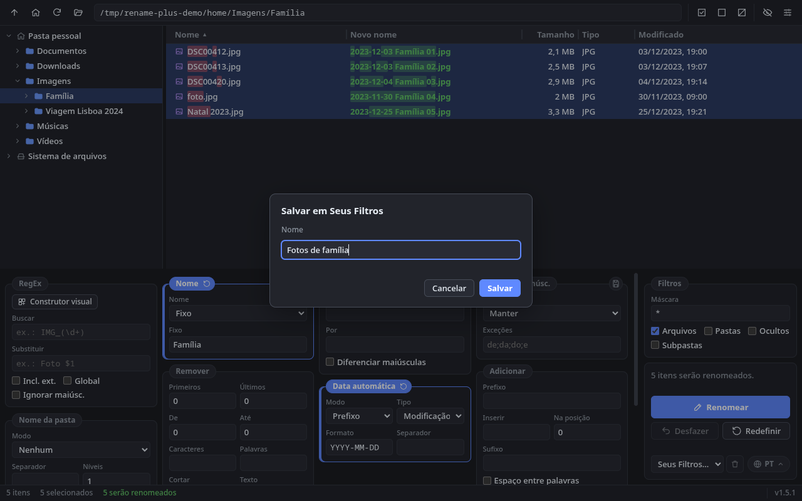

<p align="center">
  
</p>

<h1 align="center">Rename Plus</h1>

<p align="center">
  Renomeador de arquivos e pastas em lote, com pré-visualização ao vivo, para Linux e Windows.
</p>

<p align="center">
  <a href="README.md">English</a> · <b>Português (Brasil)</b> · <a href="README.es-ES.md">Español</a>
</p>

<p align="center">
  <a href="https://github.com/generson-a-silva/rename-plus/releases/latest"></a>
  
  
  
  
</p>

<p align="center">
  <a href="https://github.com/generson-a-silva/rename-plus/releases/latest"></a>
</p>

<p align="center">
  
</p>

---

## Sumário

- [Sobre](#sobre)
- [Telas](#telas)
- [Inspiração e créditos](#inspiração-e-créditos)
- [Funcionalidades](#funcionalidades)
- [Como as regras são aplicadas](#como-as-regras-são-aplicadas)
- [O que o Rename Plus não faz](#o-que-o-rename-plus-não-faz)
- [Plataformas suportadas](#plataformas-suportadas)
- [Instalação](#instalação)
- [Atalhos de teclado](#atalhos-de-teclado)
- [Desenvolvimento](#desenvolvimento)
- [Onde ficam as preferências](#onde-ficam-as-preferências)
- [Autor](#autor)

## Sobre

O **Rename Plus** renomeia muitos arquivos e pastas de uma vez a partir de regras combináveis: expressão regular, substituição de texto, maiúsculas/minúsculas, remoção de trechos, prefixos e sufixos, data, nome da pasta, numeração e extensão.

Antes de qualquer alteração no disco, a coluna **Novo nome** mostra o resultado de cada item selecionado. Conflitos, como dois arquivos com o mesmo nome final ou caracteres proibidos pelo sistema, aparecem em vermelho e bloqueiam a operação. Depois de renomear, é possível **desfazer** o último lote.

A interface segue o modelo de três áreas: árvore de pastas à esquerda, lista de arquivos à direita e painéis de regras embaixo, com os botões **Renomear**, **Desfazer** e **Redefinir** sempre visíveis.

## Telas

<table>
  <tr>
    <td width="50%" valign="top">
      <a href="docs/screenshots/subpastas.png"></a>
      <p><b>Várias regras e subpastas.</b> Remover, Substituir, Título, Numeração por pasta e extensão em minúsculas, aplicados às faixas de dois CDs de uma vez (tema claro).</p>
    </td>
    <td width="50%" valign="top">
      <a href="docs/screenshots/conflitos.png"></a>
      <p><b>Conflitos.</b> Nomes repetidos no lote ou iguais a um arquivo que já existe ficam em vermelho, e o botão Renomear é bloqueado. O motivo aparece ao passar o mouse sobre a linha.</p>
    </td>
  </tr>
  <tr>
    <td width="50%" valign="top">
      <a href="docs/screenshots/erros.png"></a>
      <p><b>Mensagens de erro.</b> Uma RegEx inválida é explicada no painel de ações; caminhos inexistentes digitados na barra de endereço aparecem em vermelho na barra de status.</p>
    </td>
    <td width="50%" valign="top">
      <a href="docs/screenshots/validacao.png"></a>
      <p><b>Validação de nomes.</b> Ao renomear um item (F2) ou criar uma pasta, nomes inválidos para o sistema são apontados antes de confirmar.</p>
    </td>
  </tr>
  <tr>
    <td width="50%" valign="top">
      <a href="docs/screenshots/arrastar.png"></a>
      <p><b>Arrastar e soltar.</b> Solte uma pasta para abri-la, ou arquivos para abrir a pasta deles já com eles selecionados.</p>
    </td>
    <td width="50%" valign="top">
      <a href="docs/screenshots/configuracoes.png"></a>
      <p><b>Configurações.</b> Tema da interface, verificação de atualizações no GitHub e pastas monitoradas, além das opções "Abrir no Rename Plus" no menu de contexto do gerenciador de arquivos.</p>
    </td>
  </tr>
  <tr>
    <td width="50%" valign="top">
      <a href="docs/screenshots/construtor-regex.png"></a>
      <p><b>Construtor visual de RegEx.</b> A busca e a substituição são montadas com blocos arrastáveis, com exemplos prontos. Aqui, <code>IMG_2041.JPG</code> vira <code>Foto 2041.JPG</code>.</p>
    </td>
    <td width="50%" valign="top">
      <a href="docs/screenshots/pastas-monitoradas.png"></a>
      <p><b>Pastas monitoradas.</b> PDFs que chegam em Downloads ganham a data na frente, viram Título e vão para <code>Documentos/Faturas</code>, mesmo com o app fechado (segundo plano ativado).</p>
    </td>
  </tr>
  <tr>
    <td width="50%" valign="top">
      <a href="docs/screenshots/pastas-monitoradas-atividade.png"></a>
      <p><b>Teste e atividade.</b> Teste a regra com um nome de exemplo antes de qualquer arquivo chegar e veja no registro de atividade o que foi renomeado (ou o que falhou).</p>
    </td>
    <td width="50%" valign="top">
      <a href="docs/screenshots/seus-filtros.png"></a>
      <p><b>Seus Filtros.</b> O botão de salvar, no canto dos painéis, guarda a combinação atual de regras (aqui, Nome fixo, Data automática e Numeração) com um nome. Depois é só escolher na lista ao lado do idioma ou nas regras das pastas monitoradas.</p>
    </td>
  </tr>
</table>

## Inspiração e créditos

O Rename Plus é inspirado no **[Bulk Rename Utility](https://github.com/BulkRenameUtility/download)**, um renomeador em lote para Windows de código fechado. A organização dos painéis numerados e a ordem em que as regras são aplicadas seguem o modelo consagrado por ele.

O Rename Plus é um projeto independente, escrito do zero:

- **não usa código** do Bulk Rename Utility;
- **não é afiliado** aos seus autores nem endossado por eles;
- **não é um substituto completo:** veja [o que o Rename Plus não faz](#o-que-o-rename-plus-não-faz).

Se você usa Windows e precisa de recursos avançados como metadados EXIF/ID3, scripts em JavaScript ou importação de CSV, conheça o Bulk Rename Utility.

## Funcionalidades

### Regras de renomeação

| Painel | O que faz |
|---|---|
| **RegEx** | Buscar e substituir com expressões regulares, com grupos de captura (`$1`, `$2`…), opção de incluir a extensão, substituição global e sem diferenciar maiúsculas. O **construtor visual** monta a expressão com blocos arrastáveis, sem digitar RegEx. |
| **Nome** | Manter, remover, trocar por um nome fixo ou inverter o nome original. |
| **Substituir** | Substituição de texto literal, com ou sem diferenciar maiúsculas. |
| **Maiúsc./Minúsc.** | minúsculas, MAIÚSCULAS, Título e Frase, com lista de palavras de exceção. |
| **Remover** | Primeiros/últimos N caracteres, intervalo por posição, caracteres e palavras específicos, cortar antes/depois de um texto, dígitos, acentos, símbolos, caracteres não ASCII, espaços duplos, espaços nas pontas e pontos iniciais. |
| **Adicionar** | Prefixo, sufixo, inserção em uma posição (negativa conta do fim) e separação de palavras coladas (`MinhaFoto` → `Minha Foto`). |
| **Data automática** | Data de modificação, criação ou atual, como prefixo ou sufixo, em formato livre (`YYYY-MM-DD`, `DD.MM.YY`…). |
| **Nome da pasta** | Acrescenta o nome de uma ou mais pastas ancestrais. |
| **Numeração** | Prefixo, sufixo, ambos ou em uma posição; início, incremento, zeros à esquerda; estilos `1, 2, 3`, `a, b, c`, `A, B, C` e `I, II, III`; reinício por pasta. |
| **Extensão** | Manter, minúsculas, MAIÚSCULAS, Título, remover, trocar por uma fixa ou acrescentar uma extra. |
| **Filtros** | Máscara de nomes (`*.jpg; *.png`), arquivos e/ou pastas, itens ocultos e conteúdo das subpastas (modo recursivo). Fica na coluna das ações. |

**Seus Filtros:** o botão de salvar, no canto superior direito dos painéis, guarda as regras atuais com um nome. Para aplicar de novo, basta escolher o nome na lista **Seus Filtros**, ao lado do seletor de idioma, que também permite excluí-lo. As regras das pastas monitoradas têm a mesma lista.

### Construtor visual de RegEx

Para quem não escreve expressões regulares: no painel **RegEx**, o botão **Construtor visual** abre uma tela em que a busca é montada com blocos, da esquerda para a direita ("Início do nome", "Texto exato", "Números", "Letras", "Separador", "Uma destas palavras"…), e a substituição também ("Texto", "Trecho guardado", "Trecho encontrado").

- Arraste os blocos da paleta para a faixa (ou clique para acrescentar no fim) e arraste pelo título para reordenar; os botões ◀ ▶ fazem o mesmo pelo teclado.
- Cada bloco define quantas vezes aparece (uma vez, opcional, uma ou mais, exatamente N, entre N e M) e se o trecho deve ser **guardado** para reaproveitar na substituição.
- Exemplos prontos: espaços → `_`, `IMG_1234` → `Foto 1234`, remover números do início, inverter datas `2024-06-10` → `10-06-2024`, remover `(…)`.
- Pré-visualização nos arquivos selecionados e num nome digitado; a expressão gerada fica visível para quem quiser conferi-la.

### Pastas monitoradas

Em **Configurações › Pastas monitoradas**, escolha uma pasta (ex.: Downloads): todo arquivo novo que chegar nela é renomeado automaticamente e, se quiser, movido para outra pasta. Por padrão não há nenhuma pasta monitorada.

- As regras de renomeação são as da tela principal: monte-as com a pré-visualização e use **Copiar regras da tela principal**, ou escolha uma opção de **Seus Filtros**.
- Filtro por máscara (`*.pdf; *.jpg`), pasta de destino opcional, teste com um nome de exemplo e notificação do sistema por arquivo.
- Espera o arquivo terminar de ser escrito; ignora downloads em andamento (`.crdownload`, `.part`…), arquivos ocultos e subpastas. Nunca sobrescreve: nomes repetidos ganham ` (2)`.
- Só arquivos novos (o que já estava na pasta não muda). O registro de atividade mostra o que foi feito e as falhas.
- **Continua com o app fechado:** com **Continuar monitorando com o app fechado** ativado, o Rename Plus inicia com a sua sessão, sem janela, e fica no ícone da bandeja enquanto houver pastas monitoradas ativas (menu da bandeja: abrir, sair). Abrir o app só mostra a janela nesse mesmo processo. Sem pastas monitoradas ativas, ele encerra na hora e não fica rodando à toa.
  - **Windows:** o instalador tem a página "Pastas monitoradas" para ativar para todos os usuários (marcada por padrão; desmarque para instalar sem). Cada usuário pode desativar em Configurações.
  - **Linux (AppImage):** não há etapa de instalação, então ative em Configurações. É criado `~/.config/autostart/rename-plus-background.desktop` (XDG Autostart, usado por KDE, GNOME, Xfce, Cinnamon…). Se mover ou trocar o AppImage, abra-o uma vez para corrigir a entrada; abrir um AppImage novo com o antigo em segundo plano passa o controle para o novo.

### Atualizações

O app consulta as [releases do GitHub](https://github.com/generson-a-silva/rename-plus/releases) ao abrir e a cada 12 horas e avisa quando há versão nova (notificação do sistema e aviso na barra de status). Nada é baixado nem instalado automaticamente. Em **Configurações › Atualizações** dá para verificar na hora, ignorar uma versão ou desligar a verificação.

### Pré-visualização e segurança

- **Pré-visualização ao vivo:** o novo nome é calculado enquanto você digita, e só para os itens selecionados.
- **Detecção de conflitos:** nomes duplicados no lote, colisão com arquivos existentes e nomes inválidos no sistema. Exemplos: `/` no Linux; `< > : " \ | ? *`, `CON`, `NUL` e ponto ou espaço no final no Windows. O motivo aparece ao passar o mouse sobre a linha.
- **Renomeação "tudo ou nada":** o lote é validado antes de tocar no disco e executado em duas etapas, o que permite trocar nomes entre arquivos (`a ↔ b`). Se algo falhar no meio, o que já foi renomeado volta ao nome original.
- **Nunca sobrescreve** arquivos existentes, inclusive ao copiar ou mover (nomes repetidos ganham sufixo ` (2)`, ` (3)`…).
- **Desfazer** o último lote de renomeação, inclusive renomeações feitas pelo menu de contexto.

### Navegação e seleção

- Árvore de pastas com carregamento sob demanda, com a pasta pessoal e as raízes do sistema (`/` no Linux, unidades `C:`, `D:`… no Windows).
- Lista de arquivos rápida mesmo em pastas grandes (renderiza só as linhas visíveis), com ordenação por coluna e colunas redimensionáveis (duplo clique na divisória ajusta ao conteúdo).
- Seleção como num gerenciador de arquivos: clique, Ctrl/Shift+clique, **arrastar para selecionar** um retângulo com rolagem automática, e clique na área livre para limpar.
- Itens ocultos ficam escondidos por padrão e podem ser exibidos (aparecem esmaecidos).

### Operações de arquivo (menu de contexto)

Botão direito na lista ou na árvore para abrir com o aplicativo padrão, mostrar no gerenciador de arquivos, renomear um item, recortar, copiar e colar, copiar o caminho, criar pasta e mover para a lixeira. Em discos sem lixeira, o app oferece excluir definitivamente, com confirmação.

### Abrir itens de fora do app

- **Arrastar e soltar:** solte uma pasta na janela para abri-la, ou arquivos para abrir a pasta deles com eles já selecionados.
- **Menu de contexto do sistema:** "Abrir no Rename Plus" (um item) e "Abrir selecionados no Rename Plus" (vários). No Windows, o instalador oferece a opção; no Linux, ela é ativada em **Configurações** para Dolphin, Nautilus, Nemo, Thunar, Caja ou PCManFM, com o gerenciador padrão do sistema em destaque.
- **Linha de comando:** `rename-plus [--open | --select] [--] caminhos…`. Com o app já aberto, os itens vão para a janela existente.

### Interface

- Tema **claro**, **escuro** ou **seguindo o sistema**, escolhido em **Configurações** (botão no canto direito da barra superior).
- Idiomas **português**, **inglês** e **espanhol**, escolhidos pelo botão no canto inferior direito da área de ações. O idioma inicial segue o sistema.
- Layout ajustável: largura da árvore, altura da área de regras (até metade da janela) e largura das colunas.
- A janela lembra tamanho, posição e se estava maximizada. Na primeira execução abre maximizada.

## Como as regras são aplicadas

As regras são aplicadas sempre nesta ordem, uma sobre o resultado da anterior:

```
RegEx → Nome → Substituir → Maiúsc./Minúsc. → Remover → Adicionar
      → Data automática → Nome da pasta → Numeração → Extensão
```

Exemplo do print principal (no topo): `IMG_2041.JPG` → RegEx troca `IMG_2041` por `Lisboa` → Data automática acrescenta `2024-06-10 ` → Numeração acrescenta ` - 01` → Extensão em minúsculas → **`2024-06-10 Lisboa - 01.jpg`**.

Em pastas, o ponto **não** é tratado como separador de extensão (`v1.2` continua sendo o nome inteiro), e o mesmo vale para arquivos ocultos como `.bashrc`.

## O que o Rename Plus não faz

Para deixar claro o escopo atual:

- **Não lê metadados de arquivos:** não usa EXIF de fotos, ID3 de músicas nem propriedades de documentos para montar nomes.
- **Não executa scripts** (ex.: JavaScript) nem importa listas de nomes de arquivos CSV.
- **Não move nem copia partes do nome** de uma posição para outra (o painel "Mover/Copiar" do Bulk Rename Utility).
- **Não altera datas, atributos nem permissões** dos arquivos; só os nomes.
- **Não move arquivos para outra pasta ao renomear** na tela principal: o novo nome fica sempre na mesma pasta (para mover, use recortar e colar). Só as pastas monitoradas movem arquivos.
- **Não roda como serviço do sistema:** o monitoramento em segundo plano roda na sua sessão de usuário (inicia quando você entra), não antes do login nem para outros usuários.
- **Não instala atualizações sozinho:** apenas avisa e abre a página da versão no GitHub.
- **Não renomeia pela linha de comando:** ela só abre pastas e arquivos no app; também não há agendamento.
- **O "Desfazer" vale só para o último lote** e só enquanto o app está aberto.
- **Limite de listagem:** mostra até 50.000 itens por vez; acima disso a lista é truncada, com aviso.
- **Não roda no macOS** por enquanto.

## Plataformas suportadas

| Sistema | Situação | Pacote | Observações |
|---|---|---|---|
| **Linux** (x64) | ✅ Suportado e testado | AppImage | Testado no KDE Plasma (Wayland). No Wayland, o sistema decide em qual monitor a janela abre, então o app restaura o tamanho da janela, mas não a posição. |
| **Windows** (x64) | ✅ Suportado | Instalador NSIS | Instala para todos os usuários (pede permissão de administrador) e cria o atalho "Rename Plus" na área de trabalho e no Menu Iniciar. Ainda em validação em máquinas reais. |
| **macOS** | 🕓 Planejado | — | Ainda não suportado. |

## Instalação

Baixe o pacote do seu sistema na **[última release](https://github.com/generson-a-silva/rename-plus/releases/latest)**, em "Assets":

| Sistema | Arquivo |
|---|---|
| Linux (x64) | `rename-plus-<versão>-linux-x86_64.AppImage` |
| Windows (x64) | `rename-plus-<versão>-win-x64.exe` |

Versões anteriores ficam na [lista de releases](https://github.com/generson-a-silva/rename-plus/releases). Para gerar o pacote a partir do código, veja [Desenvolvimento](#desenvolvimento).

### Linux (AppImage)

1. Baixe o `rename-plus-<versão>-linux-x86_64.AppImage` da [última release](https://github.com/generson-a-silva/rename-plus/releases/latest).
2. Dê permissão de execução e abra:

   ```bash
   chmod +x rename-plus-*.AppImage
   ./rename-plus-*.AppImage
   ```

3. **Opcional:** integre ao menu de aplicativos com o [AppImageLauncher](https://github.com/TheAssassin/AppImageLauncher) ou outra ferramenta de integração de AppImage.
4. **Opcional:** em **Configurações › Menu de contexto do sistema**, adicione as opções ao seu gerenciador de arquivos. Se o AppImage mudar de lugar ou de versão, basta abrir o app uma vez para corrigi-las.

### Windows

Baixe o `rename-plus-<versão>-win-x64.exe` da [última release](https://github.com/generson-a-silva/rename-plus/releases/latest), execute o instalador e siga as etapas. Uma das etapas oferece adicionar "Abrir no Rename Plus" e "Abrir selecionados no Rename Plus" ao menu de contexto do Explorador de Arquivos (no Windows 11, em "Mostrar mais opções"). O app aparece em "Aplicativos instalados" com o editor **Generson Silva** e pode ser desinstalado por lá.

## Atalhos de teclado

| Atalho | Ação |
|---|---|
| `Ctrl+A` | Selecionar todos os itens da lista |
| `Esc` | Limpar a seleção |
| `F2` | Renomear o item selecionado |
| `Delete` | Mover para a lixeira |
| `Ctrl+C` / `Ctrl+X` / `Ctrl+V` | Copiar / recortar / colar |
| `Ctrl+Shift+N` | Nova pasta |
| `Ctrl+H` | Mostrar/ocultar itens ocultos |
| `F5` | Atualizar |
| `↑` `↓` `PgUp` `PgDn` `Home` `End` | Navegar pela lista (com `Shift` para estender a seleção) |
| `Enter` / duplo clique | Abrir pasta ou arquivo |

## Desenvolvimento

**Tecnologias:** Electron, React, TypeScript, Vite, Vitest, Biome (lint e formatação) e electron-builder.

**Requisitos:** Node.js 22.12 ou superior e npm.

```bash
npm install          # instala as dependências
npm run dev          # Vite + Electron com recarga automática
npm test             # testes (Vitest)
npm run ci           # lint (Biome) + checagem de tipos + testes
npm run build        # compila para build-react/ e build-electron/
npm run dist         # gera o pacote da plataforma atual em build/
```

Para gerar o instalador do Windows a partir do Linux, use `npx electron-builder --win`. A etapa final do instalador NSIS exige o [Wine](https://www.winehq.org/); sem ele, gere o instalador numa máquina Windows.

### Estrutura do projeto

```
src/
├── main/       Processo principal: janela, sistema de arquivos, renomeação em lote, pastas monitoradas, atualizações, menus nativos
├── preload/    Ponte segura entre a interface e o processo principal (contextBridge)
├── renderer/   Interface em React (componentes, hooks e utilitários)
└── shared/     Código usado pelos dois lados: motor de renomeação, construtor de RegEx, caminhos, idiomas e contrato IPC
```

O motor de renomeação (`src/shared/rename`) é TypeScript puro, sem dependência do Electron, e é coberto por testes. Os textos da interface ficam em `src/shared/i18n/catalogs`. O português é a referência, e o TypeScript acusa se faltar alguma tradução nos outros idiomas.

## Onde ficam as preferências

Tema, idioma, regras, Seus Filtros, filtros, ordenação, larguras e última pasta aberta ficam salvos na pasta de dados do app (as pastas monitoradas em `watch-folders.json`, o modo em segundo plano em `background.json` e as preferências de atualização em `updates.json`):

- **Linux:** `~/.config/rename-plus/`
- **Windows:** `%APPDATA%\rename-plus\`

Apagar essa pasta volta o app às configurações iniciais.

## Autor

Desenvolvido por **Generson Silva**.

Inspirado no [Bulk Rename Utility](https://github.com/BulkRenameUtility/download). Veja [Inspiração e créditos](#inspiração-e-créditos).
